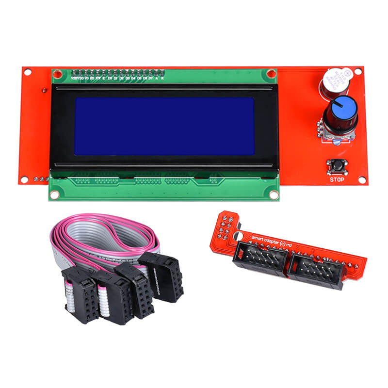

+++
categories = ['3d']
title = 'RAMPS 1.5 Marlin LCD-2004 SD card work problem'
date = 2023-09-20T02:12:50+03:00
tags = ['marlin', 'ramps', 'sd', 'lcd']
draft = false
+++

### Проблема

Делаю принтер на Arduino Mega 2560 и Ramps 1.5  
Экран RepRapDiscount Smart Controller  
Не хочет работать взаимодействие с SD картой.  

<!--more-->




Marlin 2.1.2.1

Configuration.h
``` cpp
#define SDSUPPORT  
#define REPRAP_DISCOUNT_SMART_CONTROLLER
```

Configuration_adv.h  
``` cpp
#define SDCARD_CONNECTION LCD //(без него тоже пробовал)
```

Пробовал играться с `#define SD_SPI_SPEED`, `#define SD_CHECK_AND_RETRY`

При вставке карты, на экране: `Media Init fail`    
В меню: `No media`  
В Pronterface при подключении и при извлечении карты: echo:SD card released  
Если вставить карту, то: `echo:No SD card`

Т.е. он в принципе то взаимодействует со считывальщиком карт.  
И также понятно, что `#define SD_DETECT_STATE` выставлен правильно.

Карта точно рабочая, причем с этим же экраном. Но пробовал и другие и форматировать и т.д.  
Провода так же точно рабочие.

Раньше было подключено к `MKS Base 1.5`, там все работало. только что подключил туда перепроверить, там все читается и работает.

### Решение

Предположение сначала пало на marlin, что у него в версии 2.1.x что-то переделали в работе с SD картами и с ними куча проблем.  

Но дело оказалось в самой arduino.  
Попробовал с другой - все заработало.

Причем и с версией `2.0.x` и с `2.1.x`.

