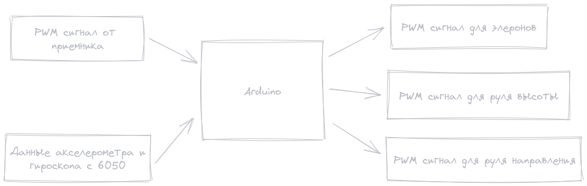

+++
title = 'Стабилизатор полета'
date = 2023-10-09T01:08:10+03:00
draft = false
+++

## Проект стабилизатора полета

### Задача

Сделать стабилизатор полета беспилотника самолетного типа.

### Концепция

#### Входные сигналы

1. Приемник управления отдает сигнал PWM по каждому каналу отдельно
1. Модуль 6050 отдает показания акселерометра и гироскопа

#### Обработчик

Arduino

#### Выходные сигналы

Отдельные PWM сигналы на сервомашинки